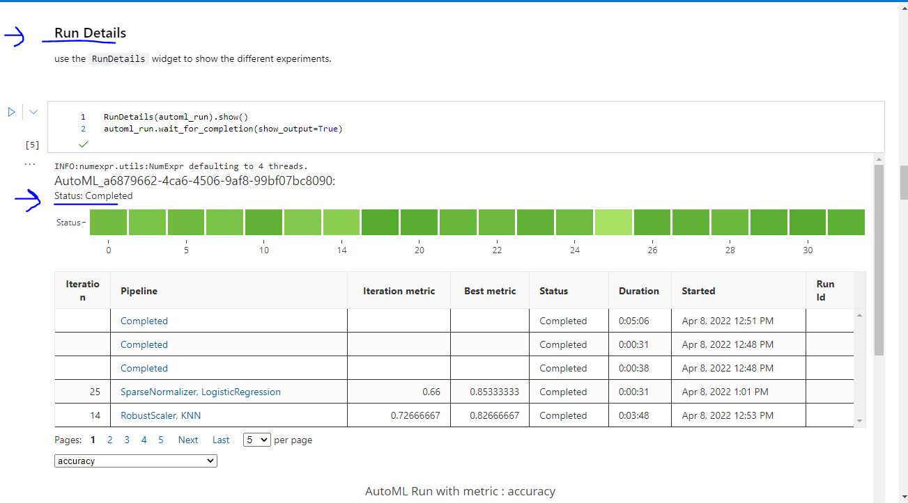
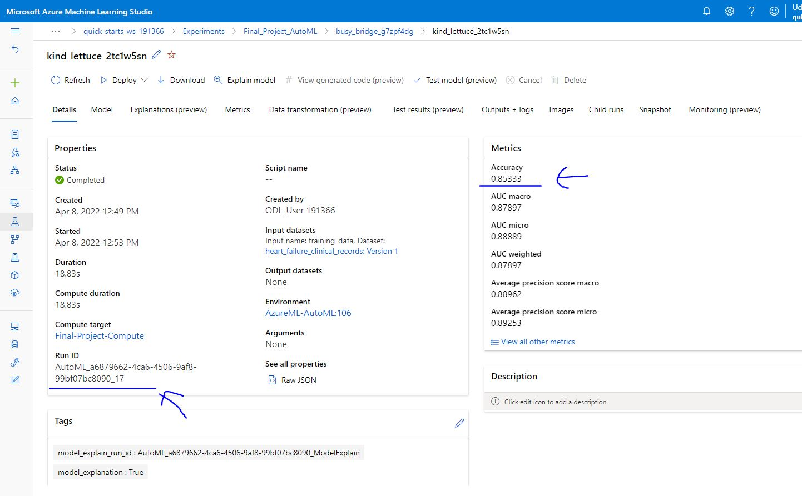
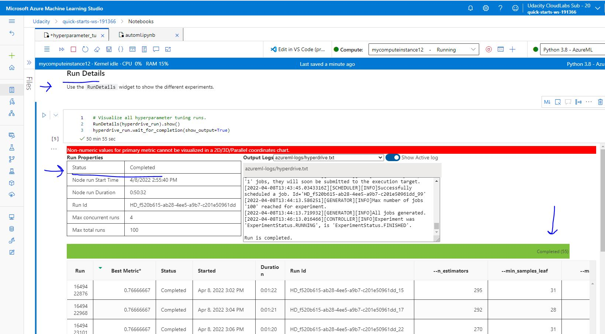
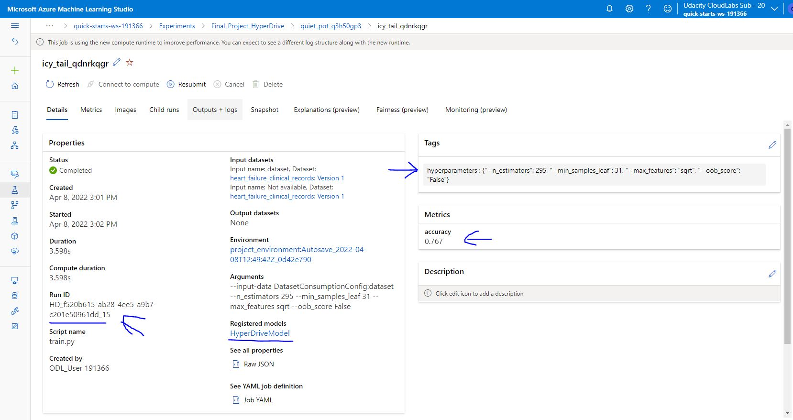
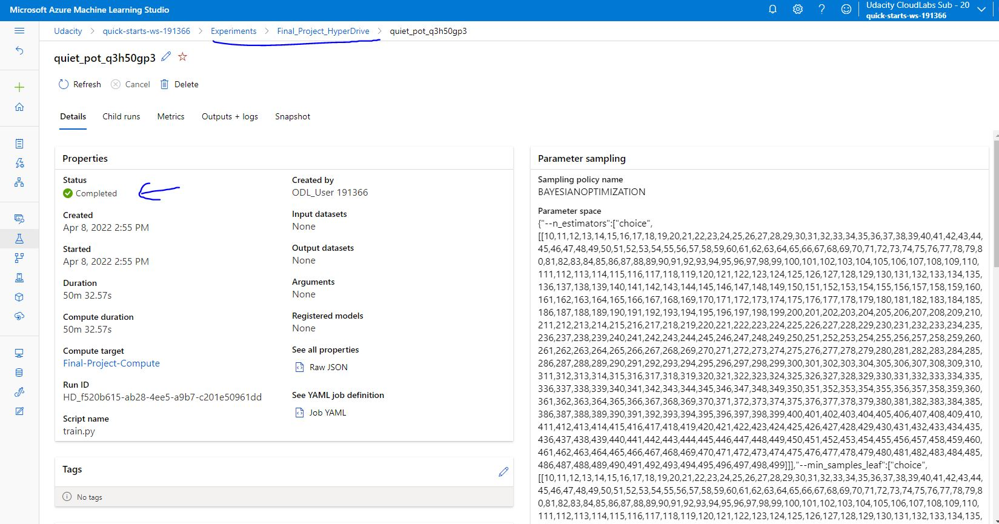

*NOTE:* This file is a template that you can use to create the README for your project. The *TODO* comments below will highlight the information you should be sure to include.

# Your Project Title Here

*TODO:* Write a short introduction to your project.

## Project Set Up and Installation
*OPTIONAL:* If your project has any special installation steps, this is where you should put it. To turn this project into a professional portfolio project, you are encouraged to explain how to set up this project in AzureML.

## Dataset

### Overview
*TODO*: Explain about the data you are using and where you got it from.

### Task
*TODO*: Explain the task you are going to be solving with this dataset and the features you will be using for it.

### Access
*TODO*: Explain how you are accessing the data in your workspace.

## Automated ML
*TODO*: Give an overview of the `automl` settings and configuration you used for this experiment

### Results
*TODO*: What are the results you got with your automated ML model? What were the parameters of the model? How could you have improved it?

Algorithm name
MaxAbsScaler, LogisticRegression

Hyperparameters : 

Data transformation:
{
    "class_name": "MaxAbsScaler",
    "module": "sklearn.preprocessing",
    "param_args": [],
    "param_kwargs": {},
    "prepared_kwargs": {},
    "spec_class": "preproc"
}

Training algorithm: :
{
    "class_name": "LogisticRegression",
    "module": "sklearn.linear_model",
    "param_args": [],
    "param_kwargs": {
        "C": 1.7575106248547894,
        "class_weight": null,
        "multi_class": "multinomial",
        "penalty": "l2",
        "solver": "lbfgs"
    },
    "prepared_kwargs": {},
    "spec_class": "sklearn"
}

Accuracy
0.85333

In the following image, we can see the `RunDetails` widget.

In the following image, we can see the best model trained with it's parameters.

## Hyperparameter Tuning
*TODO*: What kind of model did you choose for this experiment and why? Give an overview of the types of parameters and their ranges used for the hyperparameter search

"--n_estimators":["choice",
"--min_samples_leaf":["choice",
"--max_features":["choice",[["sqrt","log2"]]],
"--oob_score":["choice",[["True","False"]]]}
### Results
*TODO*: What are the results you got with your model? What were the parameters of the model? How could you have improved it?

hyperparameters : {"--n_estimators": 295, "--min_samples_leaf": 31, "--max_features": "sqrt", "--oob_score": "False"}

accuracy
0.767

In the following image, we can see the `RunDetails` widget.

In the following image, we can see the best model trained with it's parameters.

In the following image, we can see that the `Hyper Drive` experiment has been completed.

## Model Deployment
*TODO*: Give an overview of the deployed model and instructions on how to query the endpoint with a sample input.

## Screen Recording

https://youtu.be/upywb52hH5E

*TODO* Provide a link to a screen recording of the project in action. Remember that the screencast should demonstrate:
- A working model
- Demo of the deployed  model
- Demo of a sample request sent to the endpoint and its response

## Standout Suggestions
*TODO (Optional):* This is where you can provide information about any standout suggestions that you have attempted.
