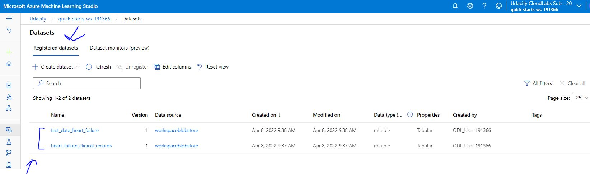
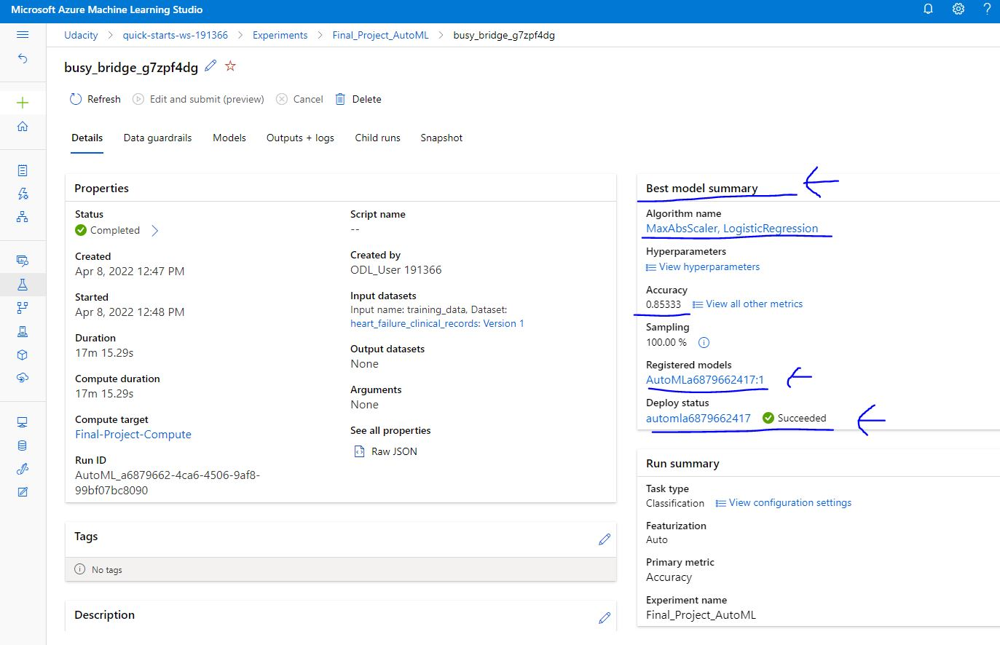
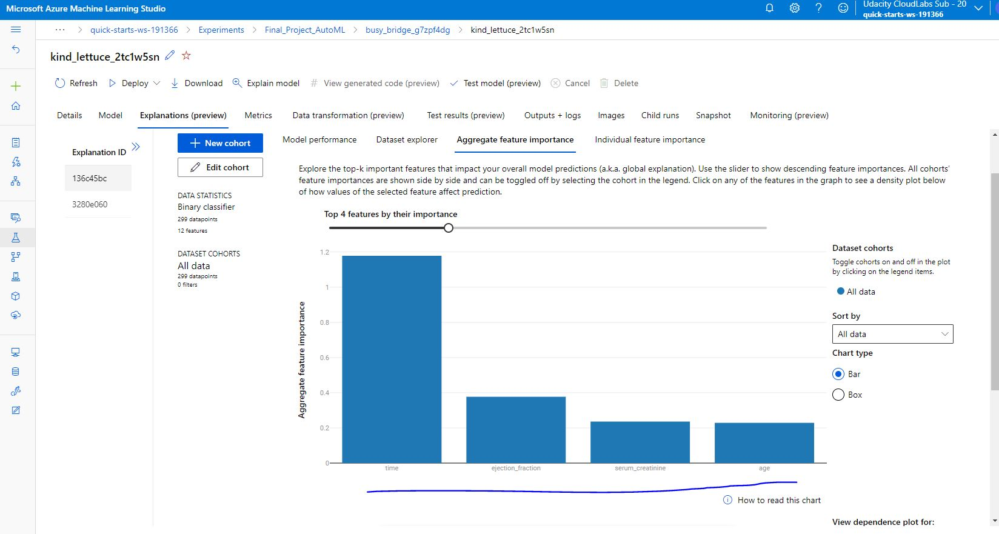
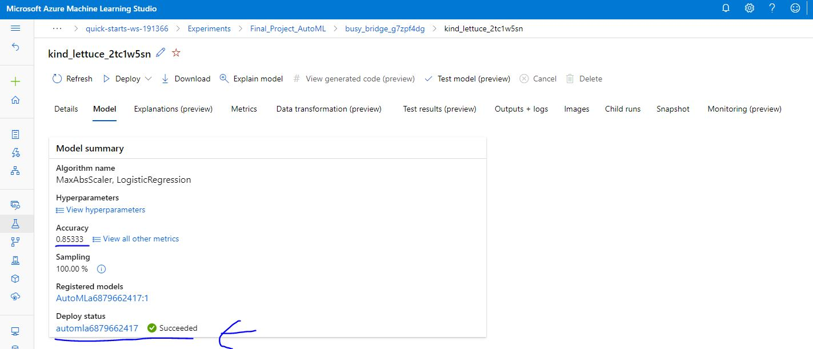
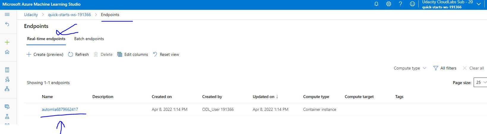
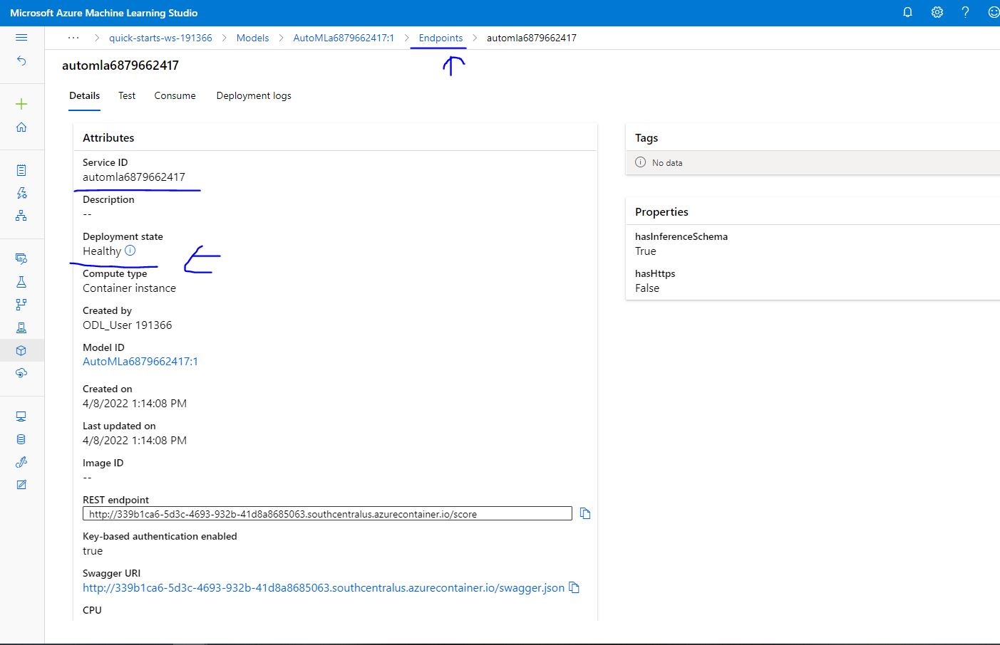

# Azure Machine Learning - Heart Failure Prediction

Cardiovascular disease are the number one cause of the death around the world, taking an estimation of around 20 million lives each year, which accounts for around 45% of all deaths worldwide. This project is aiming to utilize Azure Machine Learning to detect the most crucial features to predict the heart failure event.

## Dataset

### Overview

Heart failure is a common event caused by CVDs and this dataset contains 12 features that can be used to predict mortality by heart failure.

Somehow most of the cardiovascular diseases could be prevented by addressing behavioural risk factors such as tobacco use, unhealthy diet and obesity, physical inactivity and harmful use of alcohol using population-wide strategies.

People with cardiovascular disease or who are at high cardiovascular risk (due to the presence of one or more risk factors such as hypertension, diabetes, hyperlipidaemia or already established disease) need early detection and management wherein a machine learning model can be of great help.

The dataset can be downloaded from Kaggle : https://www.kaggle.com/datasets/andrewmvd/heart-failure-clinical-data

### Task

The task that we are going to be solving with this dataset is to predict `Death Event`.

We will be using all the features that are provided in the dataset. There are in total following features :

- age
- anaemia
- creatinine_phosphokinase
- diabetes
- ejection_fraction
- high_blood_pressure
- platelets
- serum_creatinine
- serum_sodium
- sex
- smoking
- time

### Access

For accessing the data in the workspace, the data will be manually uploaded to Azure dataset and will be registered there. Then the data can be easily access in the workspace. In the following image we can see that dataset is registered :

## Automated ML

An overview of the `automl` settings used for this experiment :

- `n_cross_validations` : Number of cross validation splits.
- `primary_metric` : This is the metric that we want to optimize.
- `experiment_timeout_hours` : Maximum amount of time in hours that all iterations combined can take before the experiment terminates.

 An overview of the parameters for `AutoMLConfig` used for this experiment :
 
 - `enable_early_stopping` : Flag to enble early termination if the score is not improving in the short term.
 - `featurization` : 'auto' / 'off' Indicator for whether featurization step should be done automatically or not.
 - `training_data` : Input dataset, containing both features and label column.
 - `label_column_name` : The name of the label column.
 - `task` : classification.

### Results

Maximum accuracy for automated ML model : `85.3 %`

Best Algorithm name : MaxAbsScaler, LogisticRegression

Best parameters of the model :

- Data transformation : MaxAbsScaler.
- Training algorithm: : LogisticRegression ("C": 1.76, "class_weight": null, "multi_class": "multinomial", "penalty": "l2", "solver": "lbfgs").

Improvements : 

- may be more parameters for `automl` settings could have been used so that it may increase accuracy.
- may be more parameters for `AutoMLConfig` could have been used so that it may increase accuracy.

In the following image, we can see the `RunDetails` widget.

In the following image, we can see the `Best model` summary.

In the following image, we can see the `Best model` trained with it's parameters.

In the following image, we can see the `Feature importance` explanation.

## Hyperparameter Tuning

Model chosen for this experiment : `RandomForestClassifier`. It combines the output of multiple (randomly created) Decision Trees to generate the final output. It leverages the power of multiple decision trees. It does not rely on the feature importance given by a single decision tree.

An overview of the types of parameters used for the hyperparameter search :

- n_estimatorsint : The number of trees in the forest.
- min_samples_leaf : The minimum number of samples required to be at a leaf node.
- max_features : The number of features to consider when looking for the best split.
- oob_score : Whether to use out-of-bag samples to estimate the generalization score.

Parameters ranges used for the hyperparameter search :

- `--n_estimators`: range(10, 500).
- `--min_samples_leaf`: range(10, 500).
- `--max_features`: sqrt, log2.
- `--oob_score`: True, False.

### Results

Maximum accuracy : `76.7 %`

Best parameters of the model : 

- n_estimators : 295.
- min_samples_leaf : 31.
- max_features : sqrt.
- oob_score : False.

Improvements : 

- may be more parameters could have been used so that it may increase accuracy.
- may be the parameters range could be increased or decreased or extend so that it may increase accuracy.

In the following image, we can see the `RunDetails` widget.

In the following image, we can see the `Best model` trained with it's parameters.

In the following image, we can see that the `HyperDrive` experiment has been completed.

## Model Deployment

An overview of the deployed model :

- 

Instructions on how to query the endpoint with a sample input :

- 

In the following image, we can see that the `Best model deployment` has been successful.

In the following image, we can see the `Real-time endpoints` overview.

In the following image, we can see the `Deployment status` of the real-time endpoint.

## Screen Recording

Link to a screen recording of the project in action : https://youtu.be/upywb52hH5E

The screencast demonstrate:

- A working model
- Demo of the deployed  model
- Demo of a sample request sent to the endpoint and its response
